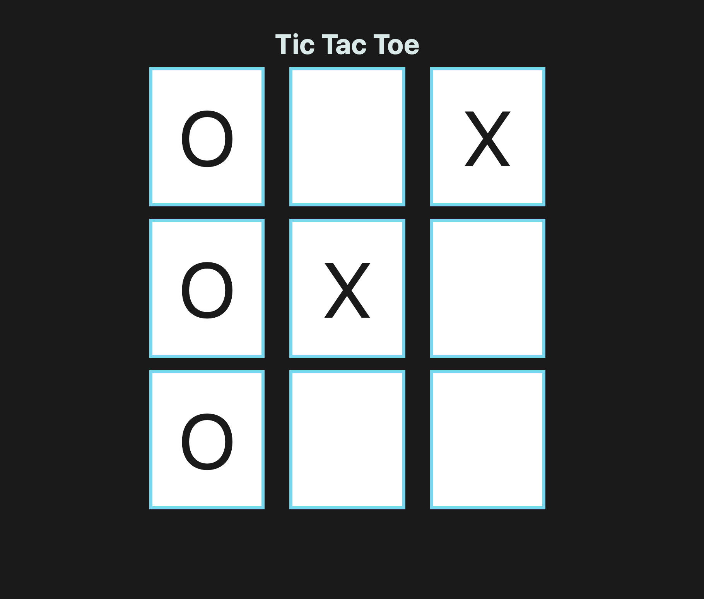

# 📖 Implement Tic-Tac-Toe Automation

Work with a partner to implement the following user story:

* As a game developer, I want to automate certain aspects of Tic-Tac-Toe.

## Acceptance Criteria

* It's done when the board's tiles are automatically styled on page load.

* It's done when the X player is blocked from winning.

* It's done when the O player has won.

## 📝 Notes

Refer to the following documentation: 

[jQuery Docs on Traversing](https://api.jquery.com/category/traversing) 

## Assets

The following image demonstrates the web application's appearance and functionality:

---

## 💡 Hint 

* There are multiple ways to accomplish a goal using method-chaining!
  
## 🏆 Bonus 

If you have completed the activity and want to further your knowledge, work through the following challenge with your partner:

* What are some alternative methods to traverse up and down the DOM tree? Use [Google](https://www.google.com) or another search engine to answer this question.

---

© 2021 Trilogy Education Services, LLC, a 2U, Inc. brand. Confidential and Proprietary. All Rights Reserved.