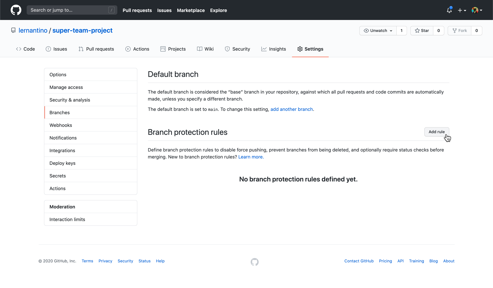
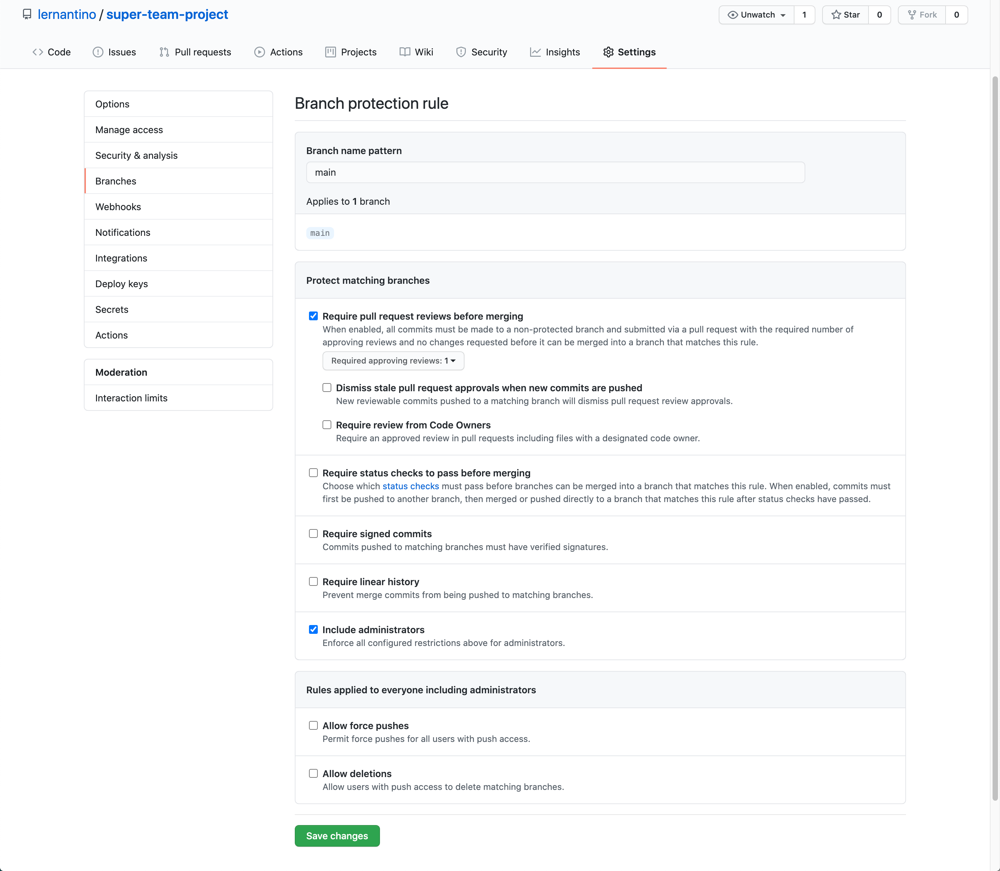
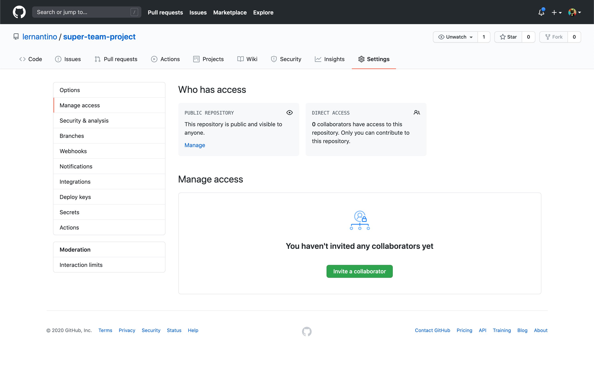
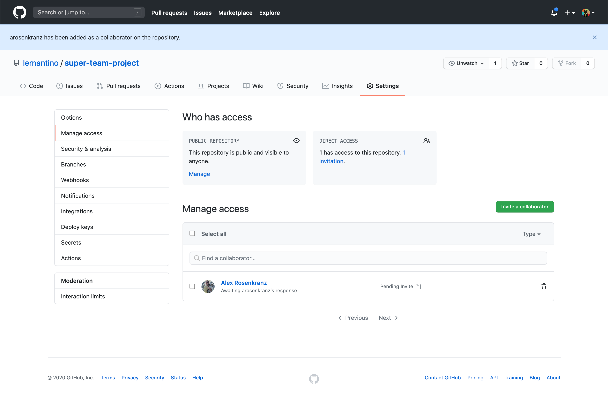

# GitHub Repository Setup for Collaborative Projects

In this activity, we will walk through how to set up GitHub repositories for a collaborative project. When multiple developers work in a single GitHub repository, certain settings and rules need to be put in place to ensure the integrity of the codebase. These rules also ensure that no one can make changes to the main code in the repository without another developer reviewing first.

> **Important:** Because this is a group-based application, only one person in the group needs to make the repository. That person will invite the other developers to join the repo as a collaborator once they have everything set up.

## Instructions

### Create the Repository and Set Up .gitignore File

* Like with all projects, we need to start by making a repository. Navigate to [GitHub](https://github.com) and create a new repository for your project. Ensure that the option to add a `README.md` file is checked. 

* Once the repository has been created, clone it to your machine using `git clone <repository-name>` and open the entire application in VS Code.

* At the root of the application, use VS Code or the command line to create a file named `.gitignore`. This file will store a list of files or folders that may end up in the application but that we don't want to keep on GitHub.

* Add the following line to the newly created `.gitignore` file:

  ```
  .DS_Store
  ```

* The `.DS_Store` file is a file unique to macOS that the operating system automatically creates to internally store a directory's attributes, so Windows users have likely not encountered this before. This file has no bearing on the actual project code, so it's best to always add it to the `.gitignore` file to ensure that it never makes it to the actual GitHub repository.

* Now save your code, commit it, and push it to the `main` branch using the following commands:

  ```bash
  git add -A
  git commit -m 'add gitignore file'
  git push origin main
  ```

* Great, now the application is ready for other developers! Before we add those developers, however, let's add some protective measures to the repo on GitHub.

### Protect the main Branch

When you work alone on a project, it's a safe assumption that any code that is pushed to the `main` branch will come from one course, so it's easy to keep track of who added what code and whether it works or not. When working with others, however, certain rules need to be put in place to keep every developer in sync and in agreement on what code is ready for production. Luckily, GitHub has some features we can add to a repo to stay in sync more easily. Let's go and add them now:

* Navigate to the repository on GitHub and select the Settings tab for the repo. The resulting page should look like the following image:

  

* Once there, look in the left column's menu and select the Branches option. Then find the Add Rule button in the main content on the right, and select it. See the following image for reference:

  

* After you select Add Rule, a page titled "Branch protection rule" will appear. On this page, we'll set up the repository so that no code can be pushed to the `main` branch by any member of the developer team. All code that is to be merged into the `main` branch MUST be merged through a GitHub pull request. Let's add the following to this page:

  * For the "Branch name pattern" input field, enter the branch `main`.

  * Next, check the box next to the option for "Require pull request reviews before merging". It will open another set of options asking if we want multiple reviewers before allowing a pull request to be merged, but we can leave it at just one for now.

  * Finally, select the option to "Include administrators". This way, even the repository owner cannot push to `main` and has to follow all of the same rules as the rest of the developers.

  * Confirm that the correct rules are in place by comparing with the following image: 

    

  * Make sure to select the Create button at the bottom of the page. The page will refresh and inform us that the rules have been created.

* Great! Now the repository's `main` branch cannot have code added to it without a pull request, and that pull request must be reviewed and approved by at least one other developer on the project. Let's go add those other developers now!

  > **Important:** We can still work locally in the `main` branch, though it's not recommended. The limitation we just put in place is that `git push origin main` will not work anymore. If you have accidentally done work in the local `main` branch and need to push it, you should checkout a new branch for that updated code and push it to that branch on GitHub instead.

### Add Collaborators to the Repository

GitHub allows developers to work together and contribute to a single repository in a few different ways. We will set up the repository so that certain other GitHub users can write data and read data to it. Let's go add these collaborators with the following steps:

* In the GitHub repository's Settings page, select Manage Access from the menu on the left side. You should see the following image:

  

* Once the modal dialog opens, start typing in the GitHub username of one of your collaborators, and the list should automatically populate that user's entry. The page should resemble the following image:

  

* Select the entry and click the "Add `<github-username>` to `<project-repo-name>`" button. The updated Manage Access page should look like the following image:

  

* Now the user will need to accept the invitation to contribute to the repository. The owner of the repository can also select the small clipboard icon next to the Pending Invite note, copy the invite link, and send it to the collaborator directly.

* This will only handle one collaborator, so repeat this process for every collaborator on the project.

* Once all of the collaborators have accepted the invite, it's time to get coding! 

### Hints

Ask an instructor or TA if you get stuck or have any questions! Now that the repository is set up, check out what [Git workflow](https://guides.github.com/introduction/flow/) can work for your group. 
