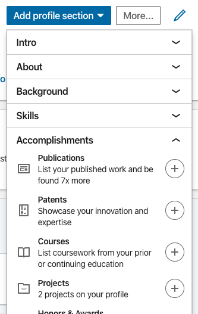
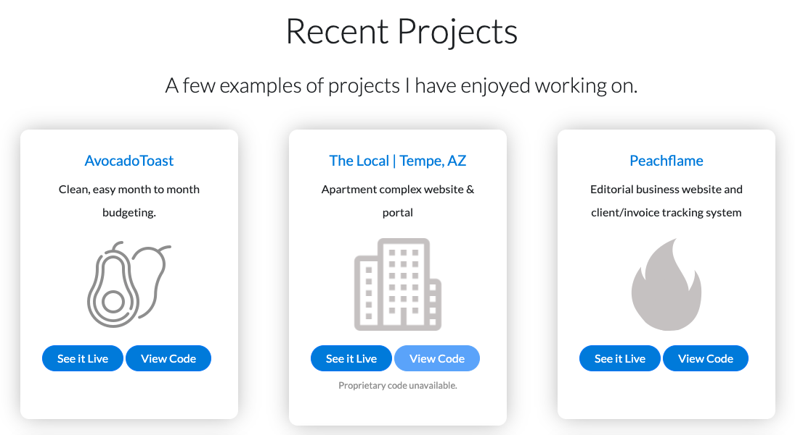

# Career Connection

## Career Connection

Up until now, you've written code and developed applications that solidified your skills as front-end developers. But now you're jumping into Node.js and getting your first taste of back-end development!

By now you should have a pretty good idea about the differences between front-end, back-end, and full-stack development. But just to be sure, let's look at a few job descriptions to clarify. 

#### Front-End Developer

A front-end developer is a web developer or engineer that writes code for the client side of a website or application&mdash;in other words, the part of the application that people see and use. They link together the two worlds of design and technology and spend much of their time writing HTML, JavaScript, or CSS to create user experiences.

#### Back-End Developer

Almost every web application users interact with is powered by server-side code. Back-end developers are responsible for this server-side code, writing API endpoints and interacting with information stored in the database. It's important for back-end developers to be able to interact with the product stakeholders and translate their business needs into technical requirements. Back-end developers typically use technologies like Node.js, Java, Python, MySQL, and MongoDB.

#### Full-Stack Web Developer

Even though we can define what front-end and back-end developers do, this line isn't always clear in practice. Front-end developers often have to learn back-end skills, and vice versa&mdash;particularly in smaller companies. A full-stack developer can work across the entire stack of technologies used in an application.

### Looking to the Future

Coding across the entire stack is a valuable skill that will make you a more attractive candidate compared to someone who can’t. As such, it is important that you market yourself in a way that emphasizes your ability to navigate between front-end and back-end development environments.

#### Step #1: Add “Full-Stack Web Developer” to Your Resume, LinkedIn, and Portfolio

If you haven't already done so, make sure that your resume, LinkedIn profile, and portfolio all include the tagline “Full-Stack Web Developer.” A good place to include this is at the beginning of your brand statement, like in the following examples:

* I am a full-stack web developer looking for new opportunities in...

* Dynamic full-stack web developer with expertise in...

#### Step #2: Add Project #1 to Your Resume, LinkedIn, and Portfolio

It's also important to showcase the projects you've completed as you learn to code. Last week, you finished up the first project! Congratulations! Now let's put that project to work.

First, ensure that your project is deployed and can be accessed without errors. Then go ahead and add it in the following places:

**Your Resume**

Add the project under Projects or Applications. List the name of the project, a description, your role, and the URL, like in the following example:

> TimeHub
> 
> * A work-efficiency tracker made for organizations with routine daily tasks. Presents employees with an interface that displays tasks and tracks the time done for each. Each task completion time is charted into a bar graph with the manager’s expected time, and that is dynamically emailed to the manager.
>
> * Lead developer of a group of three
>
> * https://time-hub.herokuapp.com/

**LinkedIn**

Go to your LinkedIn profile and click "Add profile section," then click Accomplishments and Projects, as shown in the following image:

Fill out each of the relevant fields, and add screenshots where possible to best showcase your project to your LinkedIn network. 

**Portfolio**

The Projects section of your portfolio should make it easy for prospective employers to see what you've been working on. Separate each project into an individual section or card, and provide links to both the code and the live site. Here's an example:

#### Step #3: Submit Portfolio Link on Bootcamp Spot

Last but not least, submit your portfolio on Bootcamp Spot! Once you do this, you are one step closer to being marked as employer-ready. When this happens, a number of career services resources will open up to you, such as employer networking events and webinars, online interactive workshops, and more!

### Technical Interview Preparation

Many companies use algorithm questions during the technical portion of their review process. You should answer each of these questions so that you go into an interview or promotion discussion confident in your ability to handle some of the most common questions. Even if you’re freelancing or growing your own business, these questions are helpful checks on your knowledge of this week’s material.

Please refer to the class repository to find the following algorithms:

* Coding Algorithm #1: Character Count

* Coding Algorithm #2: Product of Largest Two

* Coding Algorithm #3: Camel Case

### Career Services Events 

If you're interested in hearing more about the technical interviewing process and practicing algorithms in a mock interview setting, check out our [upcoming workshops!](https://careernetwork.2u.com/?utm_medium=Academics&utm_source=boot_camp)

---
© 2021 Trilogy Education Services, LLC, a 2U, Inc. brand. Confidential and Proprietary. All Rights Reserved.
